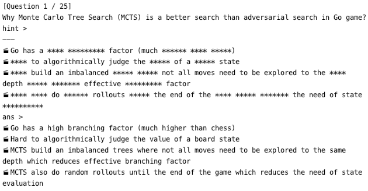

# hintcard-studytool
Instead of trying to remember entire answer of the flash card, this app asks you to remember a small portion of answer at first, by hiding `MISSING_RATE` (0-1) parts of texts in the answer. You can control the `MISSING_RATE` value by gradually increasing it to `1` to hide the entire answer.

**Demo with `MISSING_RATE` set to `0.5`**  

## How to Use
1. Download the `main.py` file.
2. In the file, set variable `DATA` to hold your Question-Answer pairs. Every Question-Answer pair is separated by `===`, and within the pair, the question and the answer are separated by `---`.
3. Set the `MISSING_RATE` with any value ranging from `0` to `1` (`0` means show everything, `1` means hide everything).
4. Run the file `python3 main.py`
